# Cuba Land Cover Classification Model Testing

<br />

<div align="center">

**[INTRODUCTION](#introduction) • 
[INSTALLATION](#installation) • 
[USAGE](#usage) • 
[PRELIMINARY RESULTS](#preliminary-results)**

</div>

<br />

## Introduction

This repository contains code for a land cover classification analysis for Cuba using Landsat 8 imagery. 4 different models are created, optimized, tested, and compared. The models are:

1. CART (Decision Tree)
2. Random Forest
3. XGBoost
4. Neural Network

## Installation

To install environment dependencies using conda, run the following command in the terminal:

```bash
conda env create --name cuba_classification --file=environment.yml
```

Then to activate the environment you can use:

```bash
conda activate cuba_classification
```

You can see independent packages and their versions in the `environment.yml` file.

You can now use the `cuba_classification` environment to run the code in the `analysis.ipynb` notebook.

## Usage

To comply with assignment guidelines, the entirety of the code is in the `analysis.ipynb` notebook.

To run the code, you will need to a Google Earth Engine account. When the notebook is first run, it will open a browser window asking you to authenticate your account. Once you have done this, it will give you an access token which you can copy and paste into the notebook (where it requests it). You only need to do this once.

Due to long runtimes during model training and preprocessing, the various models and some of the preprocessed data is saved in the `models` and `temporary` folders. If you want to re-run *all* code, you can delete these folders and re-run the notebook. **Note: This will take multiple hours**. If you want to re-run only parts of the code, you can delete the specific files you want to re-calculate.

## Preliminary Results

<br />

<div align="center">

**[Model Setup](#model-setup) • 
[Prediction Accuracies](#prediction-accuracies) • 
[Model Performance](#model-performance) • 
[Feature Importance](#feature-importance) •
[Testing on Isla de la Juventud](#testing-on-isla-de-la-juventud) •
[Neural Network Structure](#neural-network-structure)**

</div>

<br />

### Model Setup

All models were trained using the same 75/25 train-test split. Each of the 6 land cover classes were randomly sampled for 10,000 samples (60,000 total). The input data was the 8 30-meter resolution bands of the Landsat 8 imagery. Landsat imagery was stitched together to create mosaic covering the whole of Cuba. Preprocessing then included removing clouds and getting the median values over a year to reduce noise.

Architecture for the **neural network** can be seen below ([Neural Network Structure](#neural-network-structure)).

The **CART, Random Forest, and XGBoost** where tested with 5-fold cross-validation to determine the best hyperparameters (max depth, number of estimators, minimum samples split). The best hyperparameters were then used to train the models on the entire training set.


### Prediction Accuracies

| Model         | Training Accuracy | Testing Accuracy | Difference |
| ------------- | ----------------- | ---------------- | ---------- |
| Neural Network| $0.953312$   | $0.948697$   | $0.004615$    |
| Random Forest | $0.992581$   | $0.933700$   | $0.058881$    |
| XGBoost       | $1.000000$   | $0.936889$   | $0.063111$    |
| CART          | $0.990997$   | $0.914020$   | $0.076977$    |

### Model Performance


The confusion matrix provides a detailed breakdown of the model's predictions for each class.

<div align="left">
    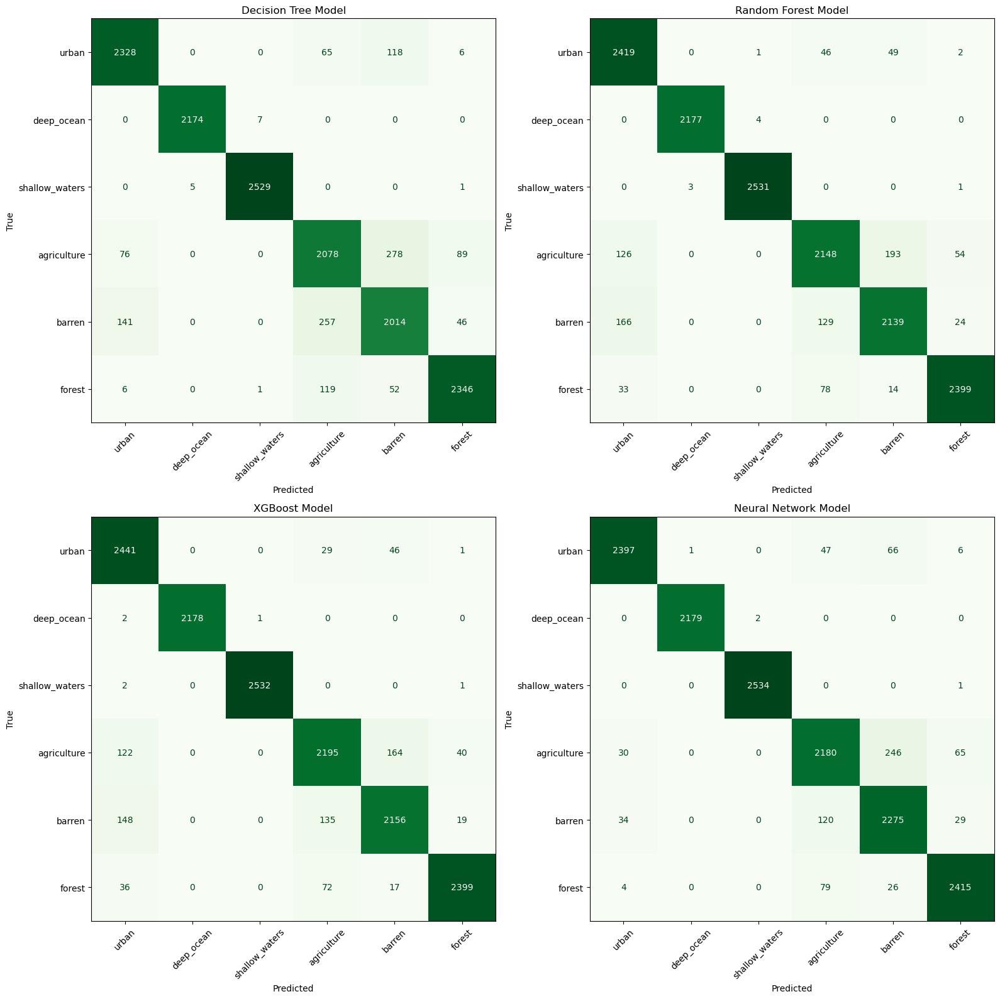
</div>

We can also calculate the precision, recall, and F1-score for each class. All models excelled at predicting shallow and deep water, but struggled most with differentiating between barren and agriculture lands. Overall, all models performed well; however, the neural network model exhibited the best performance (particularly at detecting urban areas).


| CART | Random Forest |
| ---- | ------------- |
| 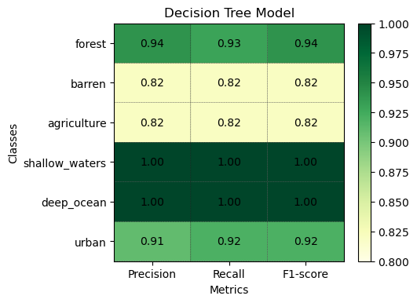 | 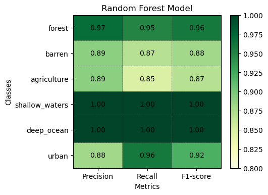 |

| XGBoost | Neural Network |
| ------- | -------------- |
| 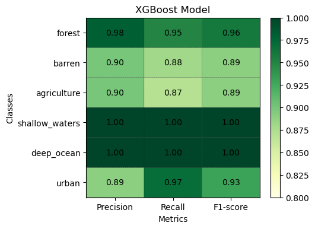 | 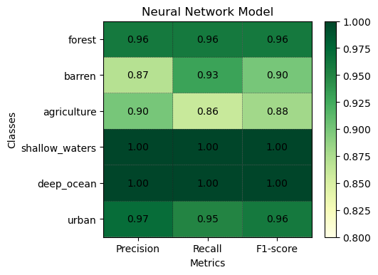 |

### Feature Importance

The feature importance for the CART, Random Forest, and XGBoost models are shown below. The neural network model does not have feature importance, as it is a black-box model. Predictably, bands 5, 4, and 3 (NIR, Red, and Green) are the most important for all models. Why this was expected will be further discussed in the final report. 

| CART | Random Forest | XGBoost |
| ---- | ------------- | ------- |
| 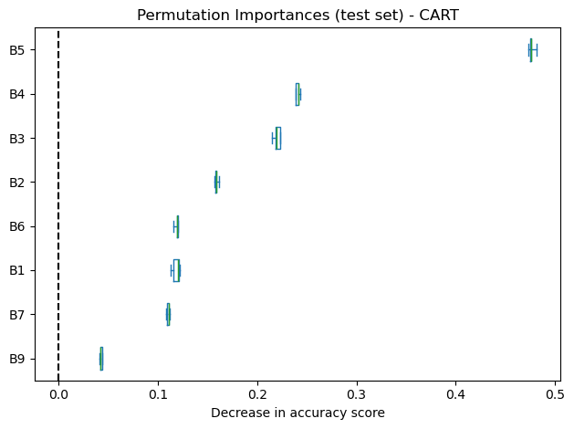 | 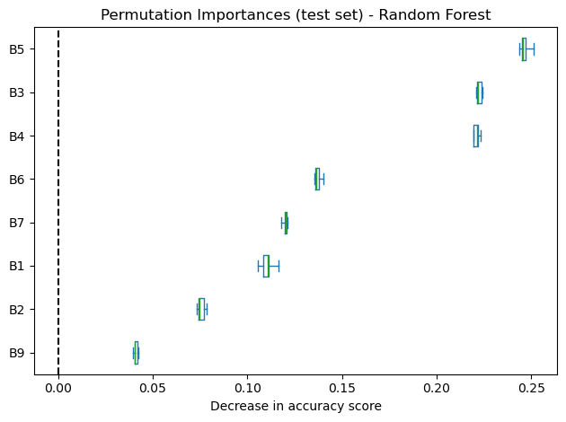 | 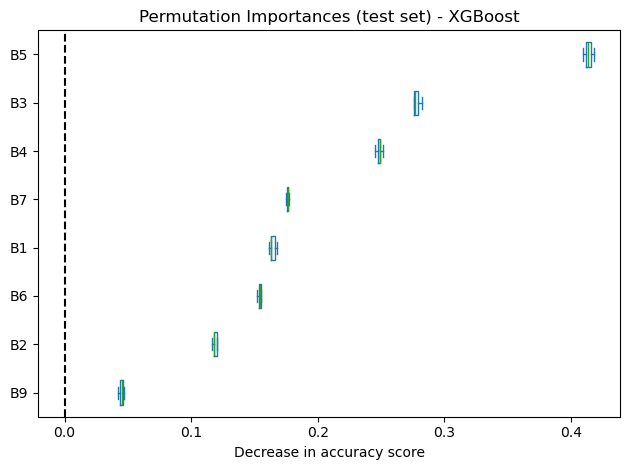 |

<div align="center">
    <h3>Scaled Bands for Isla de La Juventud</h3>
    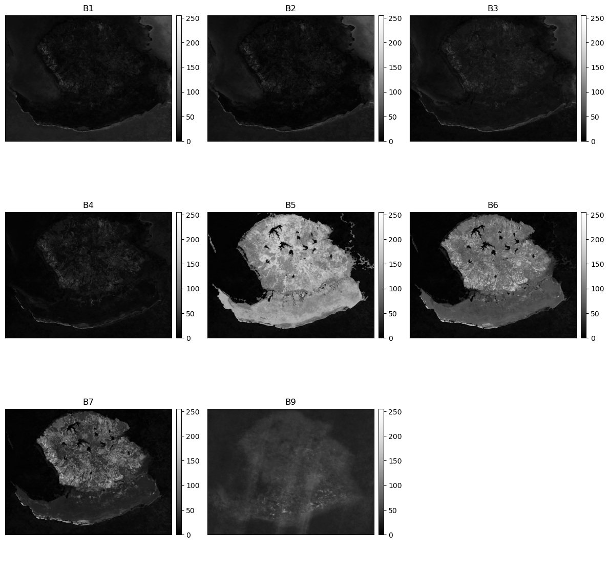
</div>

### Testing on Isla de la Juventud

We can run the models on a portion of Cuba to visualize the differences in predictions. Due to processing restrictions, the models were ran on Cuba's second largest island, Isla de la Juventud. The predictions are shown below.

<div align="center">
    <h3>Predicted Land Cover | Reference Scaled RGB Image</h3>
    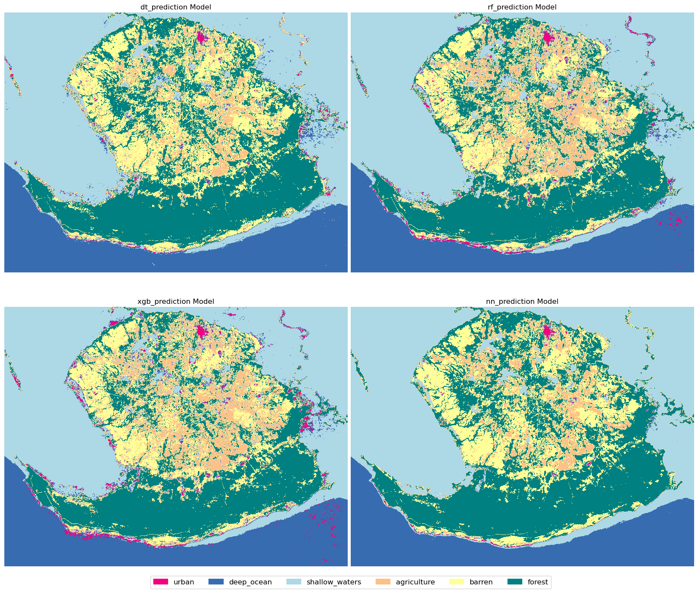
    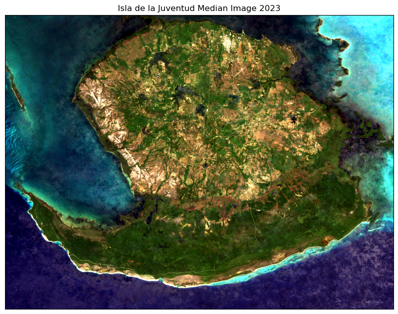
</div>

### Neural Network Structure
The neural network structure was determined through an iterative trial and error process to in order to maximize accuracy.

This sequential model starts with two sets of Conv1D layers with ReLU activation and 'same' padding to preserve spatial information. Dropout layers are included after each convolutional set to prevent overfitting. Subsequently, two dense layers with decreasing neuron counts are employed for further feature processing and dimensionality reduction. The output layer comprises a Dense layer with softmax activation, outputting probabilities for the 6 land cover classes. The model is trained using the Adam optimizer with categorical cross-entropy loss, and early stopping is employed to prevent overfitting and improve efficiency during training.

<div align="center">
    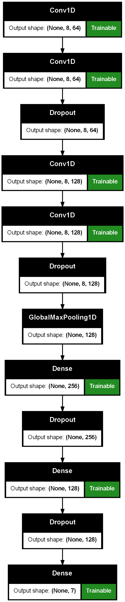
</div>

#### Neural Network Training

The training history of the neural network model is shown below:

<div align="center">
    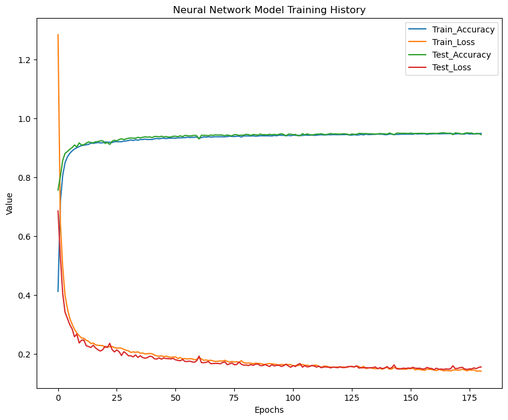
</div>
